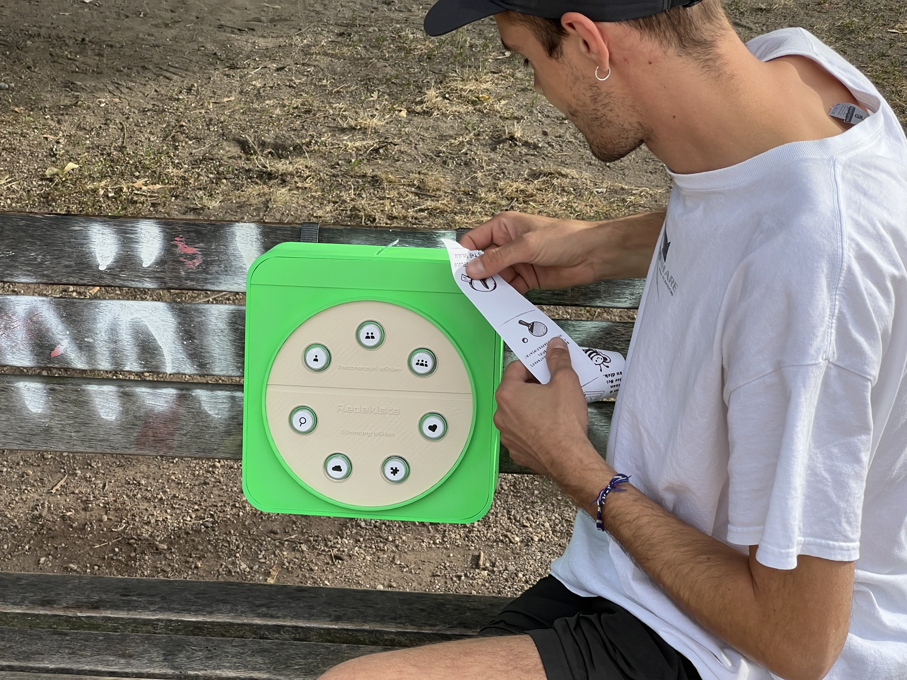
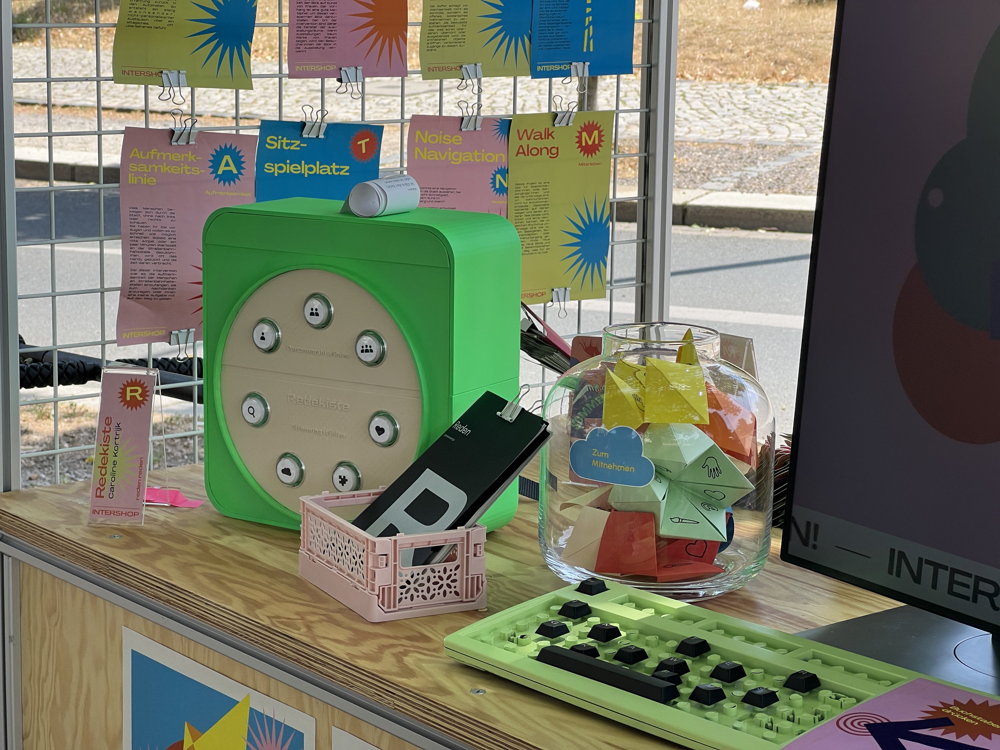
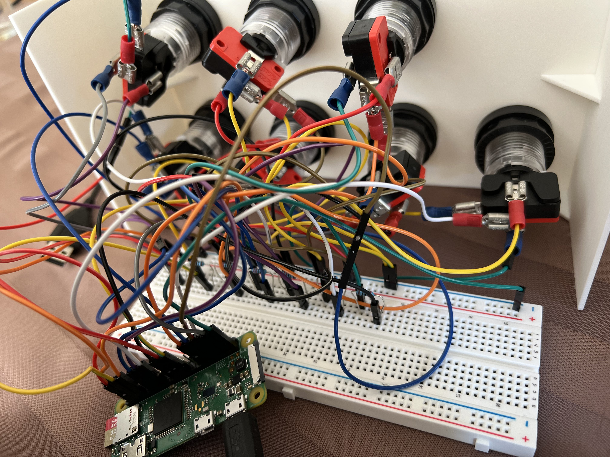
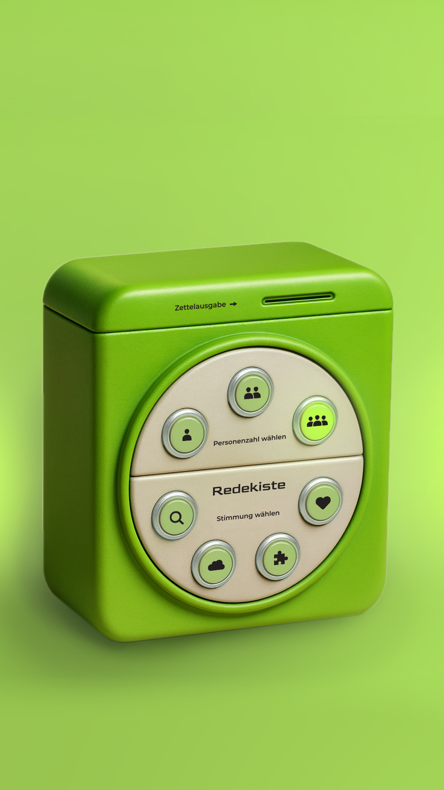
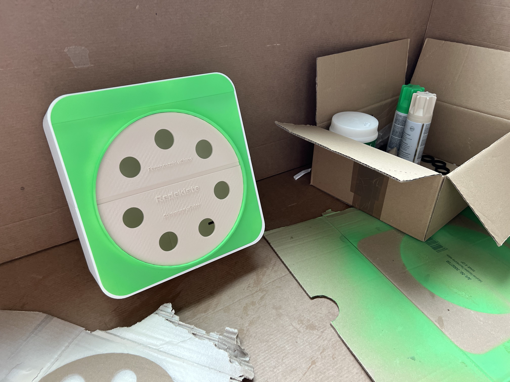

# 🎭 Redekiste

*Ein blinkendes Objekt, das Neugier weckt und im Laufe des Gesprächs hoffentlich fast schon vergessen wird.*




## 🎬 Die Redekiste in Aktion



*Sieh dir an, wie die Redekiste Menschen im öffentlichen Raum zum Gespräch einlädt!*

---

## 📖 Über das Projekt

Die **Redekiste** ist ein Automat, der im öffentlichen Raum – konkret auf Parkbänken – installiert wird und kleine, gedruckte Impulse auf Thermopapier ausgibt. Diese Impulse regen Gespräche an oder laden zur Selbstreflexion ein. Ziel ist es, Kommunikation zu fördern und Resonanz zu ermöglichen – zwischen Menschen, aber auch zwischen Individuum und Umgebung.

### Das Problem

Im öffentlichen Raum gehen Menschen nebeneinander her. Sie haben vielleicht ähnliche Wege und ähnliche Gedanken, erfahren das aber nicht voneinander. Viele vermeiden Interaktionen mit anderen Menschen nach Möglichkeit, denn es umtreibt sie die Sorge, andere zu stören.

### Die Lösung

Der Automat soll auflockern und einladen. Er bietet den Gesprächseinstieg. Er ist ein blinkendes Objekt, das Neugier weckt und im Laufe des Gesprächs hoffentlich fast schon vergessen wird. Die Inhalte sind niederschwellig, offen interpretierbar und humorvoll oder tiefgehend.

## 🎨 Gestaltung

Die äußere Form der Redekiste erinnert an eine **kleine Waschmaschine**. Diese Analogie ist in erster Linie humorvoll gemeint – sie zieht Blicke auf sich, erzeugt Vertrautheit und macht neugierig.

> *Der Waschmaschine zusehen: Da wirbeln die Gedanken mit der Wäsche.*

Auch in der Redekiste wird etwas in Bewegung gebracht – nicht Textilien, sondern Denkprozesse, Gespräche, neue Perspektiven. Der Druck auf den Knopf setzt einen kleinen Kreislauf in Gang, der die Gedanken einmal durchspült. Die Gestaltung zitiert bewusst ein Alltagsobjekt, das für Transformation und wiederkehrende Routinen steht – und bricht diese Routinen gleichzeitig auf. So wird die Redekiste zu einem stillen, charmanten Störer im Stadtbild.

## 🎮 Funktionsweise

Die Nutzer:innen wählen per Taster aus:

### 1. Wer bist du? (Person)
- **A**: Alleine
- **B**: Zu zweit
- **C**: Zu mehreren

### 2. Wie fühlst du dich? (Stimmung)
- **1**: Verliebt 💕
- **2**: Grübelnd 🤔
- **3**: Neugierig 🔍
- **4**: Verspielt 🎲

### 3. Impulse erhalten

Auf Grundlage dieser Auswahl gibt der Automat eine passende Gesprächsanregung oder Denkaufgabe per Thermodrucker aus.

**Interaktionsablauf:**
1. **Aufmerksamkeitsmodus**: LEDs blinken im Wechsel und laden zur Interaktion ein
2. **Auswahl treffen**: Drücke erst einen Personen-Taster, dann einen Stimmungs-Taster (oder umgekehrt)
3. **Visuelles Feedback**: Die gewählten LEDs leuchten dauerhaft
4. **Ausgabe**: Der Thermodrucker gibt einen passenden Impuls aus
5. **Reset**: Nach dem Druckvorgang kehrt das System in den Aufmerksamkeitsmodus zurück

## 📐 Bauanleitung – Nachbauen erwünscht!

Du möchtest deine eigene Redekiste bauen? Großartig!

### 📘 Detaillierte Hardware-Anleitung

Eine vollständige Bauanleitung zum Nachbau der Hardware findest du in der Datei:
**[`Redekiste-knappe-Bauanleitung.pdf`](Redekiste-knappe-Bauanleitung.pdf)**

Die Anleitung enthält:
- ✅ Vollständige Materialliste mit Bezugsquellen
- ✅ Schritt-für-Schritt-Aufbau mit Bildern
- ✅ Verkabelungsplan für alle Komponenten
- ✅ Montagehinweise für Parkbänke
- ✅ Tipps zur Gehäusegestaltung

### 🛠️ Was du brauchst

**Hardware:**
- Raspberry Pi Zero (oder neuer)
- Thermodrucker mit Akku (USB, Modell: 0x0456:0x0808)
- 7 beleuchtete Drucktaster (3 für Personen, 4 für Stimmungen)
- 7 LEDs zur Statusanzeige
- Widerstände und Kabel
- Gehäuse (z.B. im "Waschmaschinen"-Stil)
- Befestigungsmaterial für Parkbank

**Software:**
- Python 3
- Bibliotheken: `gpiozero`, `python-escpos`

### 🚀 Software-Installation

```bash
# System aktualisieren
sudo apt-get update
sudo apt-get install python3 python3-pip

# Python-Abhängigkeiten installieren
pip3 install gpiozero python-escpos

# Drucker-Berechtigungen setzen
sudo usermod -a -G lp pi
sudo usermod -a -G dialout pi

# Repository klonen
git clone https://github.com/Ciantoria/Redekiste.git
cd Redekiste

# Programm starten
python3 Redekiste.py
```

### 🎨 Inhalte erstellen

Erstelle 12 Bilddateien (JPG) für alle Kombinationen:
- **Format**: `[Person][Stimmung].jpg`
- **Beispiele**: `A1.jpg` (Alleine & Verliebt), `C3.jpg` (Zu mehreren & Neugierig)
- **Inhalt**: Gesprächsimpulse, Denkaufgaben, Spiele – deiner Kreativität sind keine Grenzen gesetzt!

Die Bilder sollten für den Thermodruck optimiert sein (hoher Kontrast, klare Linien).

## 📍 Verortung

Der Automat ist fest an einer Parkbank montiert. Genau dort, wo Gespräche entstehen können. Durch seine Platzierung an der Rückenlehne wird er Teil der Sitzgelegenheit selbst und lädt Passant:innen ein, sich niederzulassen, zu verweilen und in Resonanz zu treten.

### Mobile Installation

Die Redekiste ist mobil gedacht und kann auf unterschiedlichen Bänken im Stadtraum installiert werden:
- 🏛️ Inmitten eines belebten Platzes
- 🌊 Am ruhigen Elbuferweg
- 🌳 Im Schatten eines alten Baums

Je nach Standort verändert sich sein soziales Umfeld, sein Publikum, seine Wirkung.

## 🔧 Technische Details

### Technischer Aufbau

Im Inneren der Redekiste stecken:
- **Thermodrucker mit Akku** (USB, Modell: 0x0456:0x0808)
- **Raspberry Pi Zero** (kompakter Einplatinencomputer, arbeitet komplett offline)
- **7 beleuchtete Drucktaster** (3 für Personen, 4 für Stimmungen)
- **7 LEDs** zur Statusanzeige
- **Widerstände** und jede Menge Kabel

Die Steuerung übernimmt der Raspberry Pi über ein Python-Skript, das den eingehenden Tastendruck erkennt und einem bestimmten Ausgabeinhalt zuordnet. Dieser wird über den Thermodrucker direkt auf einen Zettel ausgegeben.



### GPIO Pin-Belegung

**Personen-Taster & LEDs:**
- Person A (Alleine): Button GPIO 5, LED GPIO 4
- Person B (Zu zweit): Button GPIO 11, LED GPIO 3
- Person C (Zu mehreren): Button GPIO 9, LED GPIO 2

**Stimmungs-Taster & LEDs:**
- Stimmung 1 (Verliebt): Button GPIO 19, LED GPIO 10
- Stimmung 2 (Grübelnd): Button GPIO 26, LED GPIO 22
- Stimmung 3 (Neugierig): Button GPIO 13, LED GPIO 27
- Stimmung 4 (Verspielt): Button GPIO 6, LED GPIO 17

### Features

- ✅ **Offline-Betrieb**: Keine Internetverbindung nötig
- ✅ **Interrupt-basierte Button-Behandlung** mit Entprellung (0.1s bounce time)
- ✅ **Multi-Threading** für Blink-Animation
- ✅ **Automatischer Reset** nach Druckvorgang
- ✅ **Sperre der Taster** während des Druckvorgangs
- ✅ **Visuelles Feedback** durch LEDs
- ✅ **Akkubetrieb** für mobile Installation

### Code-Struktur

```
Redekiste.py
├── GPIO Setup (Taster & LEDs)
├── Blinkanimation (Aufmerksamkeitsmodus)
├── Reset-Funktion
├── Druckfunktion
└── Event-Handler für Interaktionen
```

### Statusvariablen

- `selected_person`: Speichert die gewählte Person (A, B, C)
- `selected_mood`: Speichert die gewählte Stimmung (1, 2, 3, 4)
- `printing`: Sperrt Taster während des Druckvorgangs
- `attracting`: Steuert den Blink-Modus

## 🎨 Anpassungsmöglichkeiten

- **Gesprächsimpulse**: Passe die JPG-Dateien an deine Zielgruppe oder den Standort an
- **Anzahl der Optionen**: Erweitere oder reduziere Personen/Stimmungen im Code
- **Blink-Muster**: Modifiziere die `attract_loop()`-Funktion für andere Animationen
- **Druckdauer**: Anpassung des `time.sleep()`-Wertes in `simulate_print()`
- **Zufallsauswahl**: Implementiere eine Liste von Inhalten pro Kombination mit `random.choice()`

## 💡 Beispiele für Gesprächsimpulse

Die Inhalte sind niederschwellig, offen interpretierbar und können sein:

- 💭 **Denkaufgaben**: "Wann hast du das letzte Mal etwas zum ersten Mal gemacht?"
- 🗣️ **Gesprächsanregungen**: "Erzählt euch von eurem schönsten Moment diese Woche"
- 🎯 **Spiele**: "Findet 5 Dinge in eurer Umgebung, die rot sind"
- 🌟 **Reflexionen**: "Was würde dir fehlen, wenn es diese Bank nicht gäbe?"

## 📸 Galerie

### Der fertige Automat



### Bauphase



## 🌍 Kontext: Öffentlicher Raum

Dieses Projekt versteht sich als Beitrag zur Gestaltung des öffentlichen Raums. Die Redekiste ist mehr als ein technisches Gerät – sie ist eine **Intervention**, die bekannte städtische Elemente mit neuen Funktionen auflädt und so einen Raum für Begegnung und Austausch schafft.

### Projekthintergrund

Die Redekiste entstand im Rahmen des Universitätsprojekts **"Kooperative Upgrades städtischer Elemente"**. Der öffentliche Raum bezeichnet nicht die gebaute Form der Häuser, Straßen, Laternen und Bänke, sondern was und wie in diesem materiellen Rahmen verhandelt, dargestellt, bewegt, gefeiert und überhaupt gelebt wird.

Nach dem Motto **"Large issues in small places"** adressiert die Redekiste das gesellschaftliche Bedürfnis nach zwischenmenschlicher Verbindung und freudvoller Kooperation – direkt dort, wo Menschen sich begegnen: im städtischen Raum.

## 📄 Lizenz

Dieses Projekt wurde im Rahmen eines Universitätsprojekts entwickelt und steht zur freien Verwendung und Weiterentwicklung zur Verfügung.

## 🤝 Beitragen

Ideen, Verbesserungen und Anpassungen sind willkommen! Besonders interessant wären:

- 🎨 Neue Gesprächsimpulse und Inhalte
- 🔧 Implementierung der Zufallsauswahl aus mehreren Inhalten
- 📸 Dokumentation von Installationen an verschiedenen Standorten
- 💬 Feedback von Nutzer:innen im öffentlichen Raum

Fühle dich frei, Issues zu öffnen oder Pull Requests einzureichen.

---

*Entwickelt als Teil des Projekts "Kooperative Upgrades städtischer Elemente"*
*Ein stiller, charmanter Störer im Stadtbild* 🎭